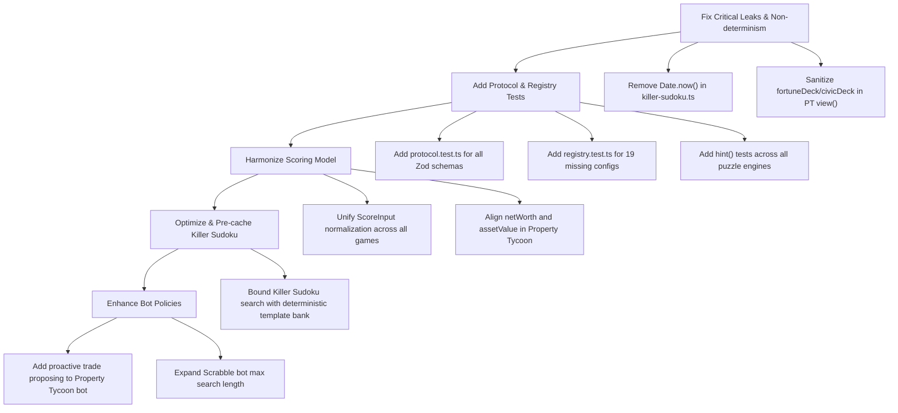

# Game and Puzzle Engine Technical Audit: Puzzle Arena

**Date**: 2026-09-12  
**Target Packages**: `packages/shared/**`, `packages/puzzles/**`, `packages/games/**`  
**Classification**: Internal Engine Architecture & Correctness Audit  
**Status**: Completed  

---

## Executive Summary

This audit evaluates the core gaming and puzzle execution engines powering **Puzzle Arena**. The scope covers the wire protocol, PRNG, and scoring definitions (`packages/shared`), puzzle generation, constraint solving, and grading engines (`packages/puzzles`), and the turn-based state reducers and bot policies (`packages/games`, focusing on Property Tycoon, Manor Mystery, and Scrabble).

The engine packages exhibit commendable architectural foundations:
- A single, centralized, deterministic Mulberry32 PRNG with state restoration (`seed, calls`) enabling bit-for-bit event replay.
- Pure turn-based state reducers with logical sequencing counters (`seq, logSeq`) independent of the wall clock.
- Rigorous mathematical uniqueness proofs using DLX/DFS backtracking with tiered logic constraint propagation.
- Strict deductive bot policies (such as Manor Mystery's propositional logic solver) operating on restricted player views.

However, several critical vulnerabilities, performance hazards, information leaks, and testing deficits were identified:

1. **Nondeterministic Generation via Wall-Clock Escapes in Killer Sudoku**: `packages/puzzles/src/killer-sudoku.ts` directly gates generation retry loops and cage-splitting rounds with `Date.now() < deadline`. Under CPU throttling, system load, or differing platform speeds, identical seeds produce entirely different puzzles or prematurely fall back to digit-revealing degradation.
2. **Critical Deck Order Information Leak in Property Tycoon `engine.view()`**: While `engine.view(s, playerId)` strips the PRNG state, it returns the entire raw game state regardless of `playerId`, exposing `s.fortuneDeck`, `s.civicDeck`, `s.fortuneIdx`, and pending trades between opponents. Cheating clients or inspection tools can foresee upcoming cards (e.g., Go To Jail, Advance to START, Repairs) turns in advance.
3. **Scoring Model Incoherence (`computeScore` vs. `assetValue` Bypass)**: The platform maintains two fundamentally incompatible scoring regimes: a normalized `[0, 1000]` model for standard puzzles and board games, and an unnormalized `ScoreInput.assetValue` bypass path for Property Tycoon, Scrabble, and Mastermind. This creates cross-game rating distortion, ranking tie-breaker anomalies, and internal progress-versus-asset contradictions.
4. **Severe Test Coverage Void in Protocol Schemas and Shared Components**: `packages/shared/src/protocol.ts` (467 lines of critical Zod schemas defining 14 game action unions, room actions, and snapshots) has **0% test coverage**. Similarly, 19 out of 20 game configuration schemas in `registry.ts` lack boundary and rejection tests.
5. **Worst-Case Latency and Solver Degeneracy**: Killer Sudoku generation exhibits severe worst-case latency requiring a 180-second test timeout. When logic fails, it degrades to revealing givens and demoting difficulty to `'easy'`. Several puzzle hint generators (`nonogram.hint`, `wordSearch.hint`, `killerSudoku.hint`) and solver utilities (`solveOrder`) are completely untested.

---

## Prioritized Findings Matrix

| ID | Severity | Focus Area | Title | Affected File(s) / Component(s) |
|---|---|---|---|---|
| **DET-01** | **Critical** | Determinism | Wall-Clock `Date.now()` Early Breaks in Killer Sudoku Generation Loop | `packages/puzzles/src/killer-sudoku.ts` |
| **SEC-01** | **Critical** | Privacy / View | Fortune and Civic Deck Order Leaked in Property Tycoon `engine.view()` | `packages/games/src/property-tycoon/index.ts` |
| **SCO-01** | **High** | Scoring | Arbitrary Score Scaling and Tie-Break Inconsistency via `assetValue` Bypass | `packages/shared/src/scoring.ts`, `property-tycoon`, `scrabble`, `mastermind` |
| **COV-01** | **High** | Test Coverage | Complete Absence of Unit Tests for Zod Protocol Action & Payload Schemas | `packages/shared/src/protocol.ts` |
| **PERF-01** | **High** | Performance | Pathological Worst-Case Generation Time and Given Degradation in Killer Sudoku | `packages/puzzles/src/killer-sudoku.ts`, `core/solver.ts` |
| **DET-02** | **Medium** | Determinism | Wall-Clock Search Deadlines in Chess Bot Break Replay Determinism | `packages/games/src/chess-core/search.ts` |
| **DET-03** | **Medium** | Determinism | Binary Floating-Point Rounding Hazards in Scoring & Financial Calculations | `packages/shared/src/scoring.ts`, `property-tycoon/index.ts` |
| **BOT-01** | **Medium** | Bot Policy | Passive Bot Trade Policy & Single-Action Limitations in Property Tycoon / Scrabble | `packages/games/src/property-tycoon/bot.ts`, `scrabble/bot.ts` |
| **COV-02** | **Medium** | Test Coverage | Untested Config Schemas in Game Registry and Missing Shared Scrabble Tests | `packages/shared/src/registry.ts`, `shared/src/scrabble.ts` |
| **COV-03** | **Medium** | Test Coverage | Untested Puzzle Hint Functions and Solvers (`hint()`, `solveOrder()`) | `packages/puzzles/src/nonogram.ts`, `word-search.ts`, `killer-sudoku.ts`, `minesweeper.ts` |
| **COV-04** | **Low** | Test Coverage | Card Effect Action Matrix & Board Multiplier Gaps in Games | `property-tycoon/index.ts`, `scrabble/scrabble.test.ts` |

---

## Detailed Findings

### CRITICAL SEVERITY

---

#### DET-01: Wall-Clock `Date.now()` Early Breaks in Killer Sudoku Generation Loop
- **File(s) / Function(s)**: `packages/puzzles/src/killer-sudoku.ts` (`generate()`, lines 281–334)
- **Why It Matters (Risk/Cost)**:
  The platform's core architecture contract asserts that game and puzzle generation is strictly deterministic based on `seed` and `difficulty`. However, `generate()` in `killer-sudoku.ts` introduces wall-clock timeouts:
  ```ts
  const BUDGET_PER_TIER_MS = 1_500;
  // ...
  for (const profile of profiles) {
    const deadline = Date.now() + BUDGET_PER_TIER_MS;
    for (let attempt = 0; attempt < 400 && Date.now() < deadline; attempt++) {
      // ...
      for (let round = 0; round < 8; round++) {
        if (Date.now() >= deadline) break;
        // ...
        if (Date.now() >= deadline) break;
      }
    }
  }
  ```
  On a fast machine (or unloaded CI runner), the loop may evaluate 80 attempts before finding a clean, 0-given, unique cage layout. On a busy production server or throttled container, `Date.now() >= deadline` fires after only 15 attempts. This causes:
  1. The generator to prematurely drop down the difficulty ladder to easier profiles.
  2. If all profiles time out, the generator falls back to `growCagesWithFallback(solution, rng, 'easy')` and reveals numerical givens (`givens[pick] = solution[pick]`).
  3. Consequently, **calling `generate({ difficulty, seed })` with the exact same seed generates different puzzles on different machines or under load**, violating crash-recovery replay guarantees.
- **Recommended Fix**:
  Replace wall-clock time bounds with deterministic operation/attempt counters. Use a fixed maximum attempt budget per tier (e.g., `MAX_ATTEMPTS_PER_TIER = 50`) and count propagation search nodes rather than querying `Date.now()`:
  ```ts
  // packages/puzzles/src/killer-sudoku.ts
  const ATTEMPTS_PER_TIER = 40;
  for (const profile of profiles) {
    for (let attempt = 0; attempt < ATTEMPTS_PER_TIER; attempt++) {
      const rng = mulberry32(opts.seed + attempt * 6151);
      const solution = generateFullGrid(rng);
      let cageCells = growCagesOnce(solution, rng, profile, false);
      if (!cageCells) continue;
      for (let round = 0; round < 8; round++) {
        const constraint = cageConstraint(
          cageCells.map((cells) => ({ cells, sum: sumOf(cells, solution) })),
        );
        if (countSolutions(noGivens, 2, constraint, 4, NODE_BUDGET) === 1) {
          return finish(cageCells, solution, [...noGivens], profile);
        }
        // ... split largest cage
      }
    }
  }
  ```

---

#### SEC-01: Fortune and Civic Deck Order Leaked in Property Tycoon `engine.view()`
- **File(s) / Function(s)**: `packages/games/src/property-tycoon/index.ts` (`view()`, lines 977–982)
- **Why It Matters (Risk/Cost)**:
  In `property-tycoon/index.ts`:
  ```ts
  function view(s: PTState, _playerId: string | null): unknown {
    // Property Tycoon is a game of open information — every board state is public.
    // Only the RNG stream is withheld, because it would predict future dice.
    const { rng: _rng, ...rest } = s;
    return rest;
  }
  ```
  The comment asserts Property Tycoon is entirely open information, which is false regarding the Chance / Community Chest decks:
  1. `rest` contains `fortuneDeck: string[]`, `fortuneIdx: number`, `civicDeck: string[]`, and `civicIdx: number`.
  2. Because the array is an ordered list of card IDs (e.g., `['f1', 'f9', 'f4', ...]`), any client inspecting the incoming WebSocket snapshot (`snapshot.state.fortuneDeck[snapshot.state.fortuneIdx]`) knows with 100% certainty the exact card that will be drawn on the next card square landing.
  3. Players or bots can exploit this to know whether landing on Fortune will advance them to START ($200), assess street repairs (hundreds in taxes), or send them to Jail.
  4. Furthermore, `rest.trades` exposes all pending private trade offers across all players, leaking bilateral trade negotiations.
- **Recommended Fix**:
  Strip card order and private trade data from `view()`:
  ```ts
  function view(s: PTState, playerId: string | null): unknown {
    const {
      rng: _rng,
      fortuneDeck: _fd,
      fortuneIdx: _fi,
      civicDeck: _cd,
      civicIdx: _ci,
      trades,
      ...rest
    } = s;
    
    // Only expose trade offers involving the requesting player
    const filteredTrades = playerId
      ? trades.filter((t) => t.from === playerId || t.to === playerId)
      : [];

    return {
      ...rest,
      fortuneDeckCount: s.fortuneDeck.length,
      civicDeckCount: s.civicDeck.length,
      trades: filteredTrades,
    };
  }
  ```

---

### HIGH SEVERITY

---

#### SCO-01: Arbitrary Score Scaling and Tie-Break Inconsistency via `assetValue` Bypass
- **File(s) / Function(s)**: `packages/shared/src/scoring.ts` (`computeScore()`, `rankResults()`, lines 7–61), `packages/games/src/property-tycoon/index.ts` (`score()`), `packages/games/src/scrabble/index.ts` (`score()`), `packages/puzzles/src/mastermind.ts` (`grade()`)
- **Why It Matters (Risk/Cost)**:
  The platform architecture specifies `computeScore(i: ScoreInput, timeLimitMs: number): number` as the universal `0..1000` normalized scoring model across all games. However, `ScoreInput` contains an `assetValue?: number` bypass field:
  ```ts
  // packages/shared/src/scoring.ts
  export interface ScoreInput {
    progress: number;
    accuracy: number;
    completed: boolean;
    completedAtMs: number | null;
    penalties: number;
    assetValue?: number;
  }
  ```
  This creates three major system design contradictions:
  1. **Scale Incompatibility**: Games using `computeScore` produce scores in `[0, 1000]`. Scrabble outputs raw word point totals (`~50 - 450`). Property Tycoon outputs net asset values (`$1,500 - $15,000+`). Mastermind outputs attempt-scaled values (`1,300 - 10,000`). Aggregated player profiles, seasonal leaderboards, or matchmaking MMR algorithms cannot compare or average scores across games without heavy distortion.
  2. **Internal Progress vs. Asset Contradiction**: In Property Tycoon:
     - `progress = netWorth / maxWorth`, where `netWorth` values buildings at 50% liquidation value and credits mortgaged properties at mortgage value.
     - `assetValue = cash + propertyValue + buildingValue`, which values buildings at 100% construction cost and gives 0 credit to mortgaged properties.
     A player can have higher `assetValue` than an opponent but lower `progress`. The client leaderboard simultaneously displays `progress` and `score`, confusing users.
  3. **Tie-Breaking Anomalies**: `rankResults()` sorts:
     `score desc -> completedAtMs asc (nulls last) -> penalties asc -> seat asc`.
     In Property Tycoon and Scrabble, `penalties` is never incremented (always 0), and `completedAtMs` is null for non-winners or games ending on pass streaks. Ties immediately fall through to `seat asc` (arbitrary lobby seat bias).
- **Recommended Fix**:
  Establish an explicit score normalization contract:
  - If games require raw domain scores (e.g. Scrabble points or Tycoon cash), store them under an explicit `domainScore` or `detail` field on `ResultRow`.
  - Normalize `score` onto the standard `0..1000` scale so all games feed the same leaderboard range.
  - Fix Property Tycoon to use a single financial calculation model for both progress and final standing.

---

#### COV-01: Complete Absence of Unit Tests for Zod Protocol Action & Payload Schemas
- **File(s) / Function(s)**: `packages/shared/src/protocol.ts` (lines 1–467)
- **Why It Matters (Risk/Cost)**:
  `protocol.ts` is the boundary defense of the entire multiplayer application. It defines Zod schemas for client inputs (`propertyTycoonActionSchema`, `manorMysteryActionSchema`, `scrabbleActionSchema`, `roomJoinSchema`, `puzzleCommitSchema`, etc.).
  Currently, **there is not a single unit test testing `protocol.ts`**.
  - Negative tests (verifying that invalid actions, extra keys, negative numbers, non-integer coordinates, or out-of-range tile counts are rejected) are completely missing.
  - For example, `propertyTycoonActionSchema` allows `proposeTrade` with `cash: z.number().int().min(0)`. If a schema regression occurs, invalid inputs bypass Zod and enter the game reducers.
  - Wire discrimination regressions on `discriminatedUnion('type', ...)` will crash socket handlers at runtime.
- **Recommended Fix**:
  Add `packages/shared/src/protocol.test.ts` testing each schema in `protocol.ts`:
  ```ts
  describe('protocol action schemas', () => {
    it('validates property tycoon buy and bid actions', () => {
      expect(propertyTycoonActionSchema.safeParse({ type: 'buy' }).success).toBe(true);
      expect(propertyTycoonActionSchema.safeParse({ type: 'bid', amount: 50 }).success).toBe(true);
      expect(propertyTycoonActionSchema.safeParse({ type: 'bid', amount: -10 }).success).toBe(false);
      expect(propertyTycoonActionSchema.safeParse({ type: 'bid', amount: 50.5 }).success).toBe(false);
    });
    it('validates scrabble placed tile coordinates', () => {
      expect(scrabbleActionSchema.safeParse({
        type: 'place',
        tiles: [{ row: 7, col: 7, letter: 'A' }]
      }).success).toBe(true);
      expect(scrabbleActionSchema.safeParse({
        type: 'place',
        tiles: [{ row: 15, col: 7, letter: 'A' }] // row max is 14
      }).success).toBe(false);
    });
  });
  ```

---

#### PERF-01: Pathological Worst-Case Generation Time and Given Degradation in Killer Sudoku
- **File(s) / Function(s)**: `packages/puzzles/src/killer-sudoku.ts` (`generate()`), `packages/puzzles/src/core/solver.ts` (`countSolutions()`, `cageConstraint()`)
- **Why It Matters (Risk/Cost)**:
  1. Generating a `'hard'` or `'expert'` Killer Sudoku requires solving a system with 0 numerical givens and 25-30 cage sum constraints.
  2. Because candidate sets on 0-given boards are huge, verifying uniqueness via `countSolutions` triggers exponential branching. The test suite in `puzzles.test.ts` had to set a 3-minute (`180_000ms`) timeout for Killer Sudoku generation.
  3. When generating rooms synchronously on a server, a 30-second hang locks Node event loop threads or delays client room creation.
  4. Furthermore, because generation frequently exhausts budgets on hard tiers, it executes lines 336–360:
     ```ts
     // Last resort: reveal digits until unique
     const cageCells = growCagesWithFallback(solution, rng, 'easy');
     // ...
     givens[pick] = solution[pick];
     return finish(cageCells, solution, givens, 'easy');
     ```
     A user requesting an "Expert Killer Sudoku" room is silently handed an Easy Killer Sudoku with revealed digits.
- **Recommended Fix**:
  1. Implement constraint satisfaction lookahead during cage growing: do not generate cages purely at random; avoid generating symmetric cage partitions that are known to yield multiple solutions.
  2. Pre-generate or offline-cache verified unique Killer Sudoku seeds per difficulty tier, or use a pre-computed template library for high difficulties.

---

### MEDIUM SEVERITY

---

#### DET-02: Wall-Clock Search Deadlines in Chess Bot Break Replay Determinism
- **File(s) / Function(s)**: `packages/games/src/chess-core/search.ts` (lines 10, 59–67)
- **Why It Matters (Risk/Cost)**:
  `chess-core/search.ts` implements iterative deepening alpha-beta search:
  ```ts
  const deadline = timeBudgetMs !== undefined ? Date.now() + timeBudgetMs : null;
  const isTimeUp = (): boolean => deadline !== null && Date.now() >= deadline;
  ```
  The comment in `chess-core/search.ts` states: `* Bots are NOT reducers — Date.now() is fine in here, unlike inside a reducer`.
  However, `bot.ts` explicitly states:
  `* Randomness must come only from rng. The scheduler's think-delay must never reach a policy, or replay stops being deterministic.`
  If a game between bots (or a human and a bot) is replayed, or if a bot turn is evaluated on a slower CPU, the search terminates at a shallower ply depth and selects a completely different move. This breaks bit-for-bit replay for any match involving chess-core bot search.
- **Recommended Fix**:
  Drive search depth by fixed node counts or maximum ply depth (`maxDepth`), rather than wall-clock `Date.now()` deadlines.

---

#### DET-03: Binary Floating-Point Rounding Hazards in Scoring & Financial Calculations
- **File(s) / Function(s)**: `packages/shared/src/scoring.ts` (`computeScore()`), `packages/games/src/property-tycoon/index.ts` (line 321), `packages/games/src/property-tycoon/bot.ts` (line 88)
- **Why It Matters (Risk/Cost)**:
  1. In `scoring.ts`:
     ```ts
     export const SCORE_WEIGHTS = { progress: 0.55, accuracy: 0.2, speed: 0.25 } as const;
     const raw = 1000 * (SCORE_WEIGHTS.progress * i.progress + SCORE_WEIGHTS.accuracy * i.accuracy + SCORE_WEIGHTS.speed * speed) - PENALTY_POINTS * i.penalties;
     return Math.max(0, Math.min(1000, Math.round(raw)));
     ```
     Neither `0.55` nor `0.20` has an exact binary floating-point representation in IEEE-754. When combined with fractional progress (e.g., `60 / 66`), rounding near `.5` can yield different values across JIT optimizations or platforms.
  2. In `property-tycoon/index.ts`:
     ```ts
     const percentage = Math.floor(netWorth(s, player.id) * REVENUE_LEVY_RATE);
     ```
     `REVENUE_LEVY_RATE` is `0.1`. Multiplying integers by `0.1` and calling `Math.floor()` can produce `199` instead of `200` due to floating point inaccuracies (`1999 * 0.1 = 199.90000000000003`).
  3. In `property-tycoon/bot.ts`:
     `if (Math.abs(diff) > 1e-9) return diff;` requires an arbitrary floating point epsilon check.
- **Recommended Fix**:
  Use integer arithmetic throughout:
  - In `scoring.ts`: Scale weights to integers: `550 * progress + 200 * accuracy + 250 * speed`.
  - In `property-tycoon`: Replace `Math.floor(netWorth * 0.1)` with `Math.floor(netWorth / 10)`.

---

#### BOT-01: Passive Bot Trade Policy & Single-Action Limitations in Property Tycoon / Scrabble
- **File(s) / Function(s)**: `packages/games/src/property-tycoon/bot.ts` (lines 149–161), `packages/games/src/scrabble/bot.ts` (lines 35–45)
- **Why It Matters (Risk/Cost)**:
  1. **Property Tycoon Bot Cannot Initiate Trades**: The bot policy only evaluates incoming trade proposals (`v.trades.find(t => t.to === selfId)`). It **never proposes trades** to human players or other bots. As a result, in games with multiple bots, monopolies are rarely formed through negotiation, stalling game progress.
  2. **Scrabble Bot Word Length Ceiling**: `scrabbleBot` hardcodes `MAX_WORD_LEN = 7`. While this guarantees bounded execution, the bot can never play 8-letter or 9-letter words, even when bridging existing tiles on the board, artificially capping hard-tier bot capability.
- **Recommended Fix**:
  1. Add a trade-proposing heuristic to `propertyTycoonBot` when it owns 2 of 3 properties in a group and another player holds the third.
  2. Allow `scrabbleBot` on `'hard'` difficulty to evaluate words up to length 9 when connecting through 2+ existing board tiles.

---

#### COV-02: Untested Config Schemas in Game Registry and Missing Shared Scrabble Tests
- **File(s) / Function(s)**: `packages/shared/src/registry.ts`, `packages/shared/src/registry.test.ts`, `packages/shared/src/scrabble.ts`
- **Why It Matters (Risk/Cost)**:
  `packages/shared/src/registry.test.ts` tests **only Mastermind configuration**.
  - None of the other 19 game schemas (`sudokuConfigSchema`, `killerSudokuConfigSchema`, `nonogramConfigSchema`, `wordSearchConfigSchema`, `minesweeperConfigSchema`, `propertyTycoonConfigSchema`, `manorMysteryConfigSchema`, `scrabbleConfigSchema`, `chessConfigSchema`, etc.) have test coverage for default values, valid boundaries, or rejection of negative/fractional numbers.
  - `packages/shared/src/scrabble.ts` has 0 unit tests in `packages/shared`. Constants like `PREMIUM_LAYOUT`, `TILE_COUNTS`, `TILE_VALUES`, and helper `freshBag()` are completely untested in the package that exports them.
- **Recommended Fix**:
  Add parameterized schema tests in `registry.test.ts` iterating over `GAME_REGISTRY` to ensure every registered game parses `{}` to valid defaults and throws on invalid types. Add `scrabble.test.ts` in `packages/shared/src/`.

---

#### COV-03: Untested Puzzle Hint Functions and Solvers (`hint()`, `solveOrder()`)
- **File(s) / Function(s)**: `packages/puzzles/src/nonogram.ts` (`hint()`), `packages/puzzles/src/word-search.ts` (`hint()`), `packages/puzzles/src/killer-sudoku.ts` (`hint()`), `packages/puzzles/src/minesweeper.ts` (`solveOrder()`)
- **Why It Matters (Risk/Cost)**:
  While puzzle generation is tested, multiple player-facing hint functions exported by `packages/puzzles` have **zero unit tests**:
  - `nonogram.hint`: Never verified to return valid `{ path: "r,c", value: 1 | 2 }` matching solution.
  - `wordSearch.hint`: Never verified to return `{ path: "y,x", value: word }` of an unfound word.
  - `killerSudoku.hint`: Never verified in `puzzles.test.ts`.
  - `minesweeper.solveOrder`: Intended for bot and auto-solvers, completely untested.
- **Recommended Fix**:
  Add tests in `packages/puzzles/src/puzzles.test.ts` verifying that calling `hint()` on partial states always returns a valid, non-revealed coordinate and value matching the solution.

---

### LOW SEVERITY

---

#### COV-04: Card Effect Action Matrix & Board Multiplier Gaps in Games
- **File(s) / Function(s)**: `packages/games/src/property-tycoon/property-tycoon.test.ts`, `packages/games/src/scrabble/scrabble.test.ts`, `packages/games/src/manor-mystery/manor-mystery.test.ts`
- **Why It Matters (Risk/Cost)**:
  - In `property-tycoon.test.ts`: Fortune and Civic card effects (`repairs`, `payEach`, `collectFromEach`, `advanceToNearest`, `back3`) are executed only through random deck draws during game simulations, never tested with deterministic unit tests. Rest Stop jackpot pot distribution is untested.
  - In `scrabble.test.ts`: Tests cover Double Word (`DW`) and Double Letter (`DL`) squares, but **never test Triple Word (`TW`) or Triple Letter (`TL`)** squares.
  - In `manor-mystery.test.ts`: `useSecretPassage` is not directly tested as an accepted user action in `reduce`.
- **Recommended Fix**:
  Add targeted unit tests covering each card effect in Property Tycoon, Triple Word/Letter scoring in Scrabble, and direct secret passage usage in Manor Mystery.

---

## Architectural Deep-Dive: Core Engine Evaluation

### 1. Determinism & Crash Recovery
The engine design achieves crash-recovery replayability by ensuring state changes are pure functions of `(state, action)` with all pseudorandomness drawn from Mulberry32.
- **Strengths**:
  - `makeLog` and `stampLogs` maintain logical clock sequences (`seq, logSeq`) rather than real timestamps.
  - `RngState` (`{ seed, calls }`) advances synchronously within the reducer state.
- **Weaknesses**:
  - Nondeterministic exit conditions in Killer Sudoku (`Date.now() < deadline`) break reproducibility across machines.
  - Floating point multiplications in scoring and financial rules introduce potential cross-runtime discrepancies.

### 2. Puzzle Generators & Solvers
- **Sudoku**: Fast bitmask solver with naked/hidden single propagation. Generator digs holes while maintaining uniqueness and tier classification.
- **Killer Sudoku**: Cage partitioning uses recursive DFS with bounding. Extremely heavy search requirements.
- **Nonogram**: Dual-direction line solver using clue permutations intersecting known cells. Good fallback handling.
- **Word Search**: Backtracking placement with 8-direction support. Guarantees words appear exactly once without accidental substring collisions from random filler letters.

### 3. Bot Policies & Information Boundaries
- **Privacy Barrier**: Manor Mystery and Scrabble strictly guard hidden information. Property Tycoon inadvertently leaks the future Chance/Community Chest deck order in its view.
- **Bot Quality**:
  - Manor Mystery features an exemplary constraint deduction engine using propositional logic fixpoint iterations.
  - Scrabble features anchor-based dictionary search with rack leave balance optimization.
  - Property Tycoon provides effective economic balance heuristics, but lacks trade proposal capabilities.

### 4. Scoring Model Architecture
The dichotomy between `computeScore` (normalized 0..1000) and `assetValue` (unbounded domain scores) should be resolved into a unified scoring contract where domain metrics are preserved as auxiliary data while competitive rankings rely on standard normalized values.

---

## Export Surface vs. Test Coverage Audit

```
Package: @puzzle-arena/shared
├── rng.ts                      [COVERED: mulberry32, rngFrom, seedFromString]
├── scoring.ts                  [COVERED: computeScore, rankResults | UNTESTED: speedComponent]
├── registry.ts                 [COVERED: mastermindConfigSchema | UNTESTED: 19 other game schemas, isPuzzle]
├── protocol.ts                 [CRITICAL GAP: 0% coverage across 467 lines of Zod schemas]
└── scrabble.ts                 [UNTESTED: 0% coverage in shared package]

Package: @puzzle-arena/puzzles
├── core/solver.ts              [COVERED: countSolutions, solve, solvePath | GAPS: isolated technique tests]
├── sudoku.ts                   [COVERED: generate, grade, hint, conflicts]
├── killer-sudoku.ts            [COVERED: generate, grade | UNTESTED: hint]
├── nonogram.ts                 [COVERED: generate, grade, runsOf | UNTESTED: hint]
├── word-search.ts              [COVERED: generate, grade, checkSelection | UNTESTED: hint]
├── minesweeper.ts              [COVERED: generate, revealCell, grade, hint | UNTESTED: solveOrder]
├── mastermind.ts               [COVERED: evaluateGuess, generate, applyGuess, grade, generateBotGuesses]
└── word-lists.ts               [COVERED: fallbackWordsFor]

Package: @puzzle-arena/games (Audited Scope)
├── property-tycoon
│   ├── index.ts / rules.ts    [COVERED: setup, reduce, rules | GAPS: card effect matrix, restStopPot]
│   └── bot.ts                  [COVERED: chooseAction across difficulties]
├── manor-mystery
│   ├── index.ts / board.ts    [COVERED: setup, reduce, deduce, view privacy | GAPS: useSecretPassage action]
│   └── bot.ts                  [COVERED: chooseAction, deduce fixpoint]
└── scrabble
    ├── index.ts / rules.ts    [COVERED: setup, reduce, rules | GAPS: TW/TL premiums, multi-cross words]
    └── bot.ts                  [COVERED: chooseAction across difficulties]
```

---

## Remediation Roadmap



### Phase 1: Security & Determinism (Immediate)
1. **Fix Killer Sudoku Determinism (`DET-01`)**: Eliminate `Date.now()` from `killer-sudoku.ts`. Drive loops solely via attempt counters and Mulberry32.
2. **Close Property Tycoon Deck Leak (`SEC-01`)**: Filter `fortuneDeck`, `civicDeck`, indices, and foreign trades out of `propertyTycoon.view()`.

### Phase 2: Test Suite Fortification (High Priority)
3. **Protocol Test Suite (`COV-01`)**: Implement exhaustive unit tests for `packages/shared/src/protocol.ts` validating all 14 action unions and client payloads.
4. **Registry & Scrabble Tests (`COV-02`)**: Add parameterized tests for all game configuration schemas and shared Scrabble tables.
5. **Puzzle Hint Tests (`COV-03`)**: Add unit test coverage for `hint()` in Nonogram, Word Search, and Killer Sudoku, and `solveOrder()` in Minesweeper.

### Phase 3: Architectural Harmonization & Quality (Medium Priority)
6. **Harmonize Scoring Model (`SCO-01`)**: Align the `assetValue` bypass path with the standardized 0..1000 score schema.
7. **Optimize Puzzle Generation (`PERF-01`)**: Improve Killer Sudoku cage generation heuristics to prevent 180s worst-case timeouts and fallback degradation.
8. **Enhance Bot Policies (`BOT-01`)**: Implement proactive trading for Property Tycoon bots and remove the length-7 word limit on Scrabble bots.
