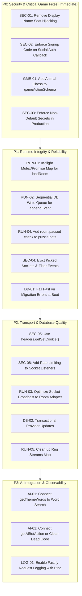

# Puzzle Arena Backend Audit Report

**Date:** September 12, 2026  
**Auditor:** Antigravity AI  
**Target:** `apps/server/**` (Fastify 5 + Socket.io 4.8 + Drizzle ORM 0.45 / Postgres + Better Auth 1.6 + In-Memory Room Runtime + AI Provider Subsystem)  
**Dependencies:** `@puzzle-arena/shared`, `@puzzle-arena/games`, `@puzzle-arena/puzzles`

---

## 1. Executive Summary

A comprehensive backend audit was conducted on the Puzzle Arena server codebase. The server implements a hybrid architecture: Fastify handles RESTful admin and room management endpoints alongside Better Auth for administrator credentials, Socket.io manages real-time multiplayer coordination, in-memory `LiveRoom` instances govern authoritative game loops and anti-cheat constraints, and Drizzle ORM provides persistence into PostgreSQL.

While the core game mechanics and anti-cheat state isolation (e.g. withholding puzzle solutions until game completion) are thoughtfully constructed, the audit revealed several critical and high-severity vulnerabilities in **session security**, **state hijacking**, **concurrency and race conditions**, **real-time event validation**, and **AI subsystem wiring**. Notably:

1. **Active Game Seat Hijacking (Critical):** A reconnection fallback in `socket.ts` allows any connecting user to take over a disconnected player's seat and game state during an active match simply by submitting the player's public display name.
2. **Admin Signup Gating Bypass via Google OAuth (Critical):** Direct social authentication through Better Auth bypasses the mandatory `ADMIN_SIGNUP_CODE` check, allowing unauthorized admin account creation.
3. **Missing Animal Chess Action Validation (High):** `packages/shared/src/protocol.ts` omitted `animalChess` from `gameActionSchema`, rendering Animal Chess unplayable for human participants over WebSockets.
4. **Disconnected AI Subsystem (Dead Code) (Medium/Architectural):** Over 900 lines of AI bot generation (`ai/bot-moves.ts`) and themed content generation tasks (`ai/tasks.ts`) are completely unreferenced and bypassed in actual gameplay, leaving the AI provider configuration as an isolated admin stub.
5. **Runtime Concurrency & Memory Leaks (High):** Asynchronous `loadRoom` calls can spawn duplicate zombie rooms; un-awaited `appendEvent` calls risk out-of-order writes and crash recovery corruption; global $O(N)$ socket iteration on state broadcasts causes event-loop latency; and puzzle bots fail to honor room pauses.

---

## 2. Summary of Findings by Severity

| ID | Finding | Severity | Category | Impact |
|---|---|---|---|---|
| **SEC-01** | Disconnected Seat Hijacking via Display Name | **Critical** | Socket / Security | Anyone can take over another player's seat and state |
| **SEC-02** | Google OAuth Admin Registration Bypass | **Critical** | Auth / Access Control | Unauthenticated users can register admin accounts without signup code |
| **SEC-03** | Hardcoded Insecure Fallback Secrets in Production | **High** | Configuration / Security | Cookie forgery, key decryption, session spoofing if env vars omitted |
| **SEC-04** | Kicked Players Remain in Socket Room & Can Action/Chat | **High** | Socket / Auth | Evicted players still receive broadcasts and can submit moves |
| **SEC-05** | Corrupted Multi-Cookie Header Forwarding (`getSetCookie`) | **Medium** | Auth / Transport | Better Auth session/CSRF cookies corrupted when multiple Set-Cookie headers fold |
| **SEC-06** | Missing `secure` Flag on Guest Identity Cookie | **Low** | Cookie Security | Insecure transport of `pa_guest` over plain HTTP |
| **SEC-07** | Indiscriminate `trustProxy: true` Without Proxy Validation | **Medium** | Rate Limiting / Security | Rate limiting and IP audits can be spoofed via `X-Forwarded-For` |
| **RUN-01** | Concurrent `loadRoom` Duplication & Zombie Rooms | **High** | Concurrency / Runtime | Multiple `LiveRoom` instances instantiated for same room ID |
| **RUN-02** | Un-Awaited Event Persistence (`appendEvent`) Race | **High** | Concurrency / DB | Gaps or out-of-order sequence persistence breaking rehydration |
| **RUN-03** | Global $O(N)$ Socket Iteration on Room Broadcasts | **Medium** | Performance / Runtime | Server-wide event loop blocking under multi-room load |
| **RUN-04** | Puzzle Bot Failure to Honor Room Pauses | **High** | Runtime / Bot Logic | Bots burn through solve paths during pauses and stop playing |
| **RUN-05** | Unbounded Memory Leak in PRNG `streams` Map | **Medium** | Memory Management | `streams` Map leaks room PRNG instances forever |
| **RUN-06** | Double Snapshot Delivery on `room:join` | **Low** | Protocol / Socket | Bandwidth waste and redundant state dispatch on client |
| **GME-01** | Missing Animal Chess Action in `gameActionSchema` | **High** | Validation / Shared | Animal Chess moves rejected by server schema validation |
| **DB-01** | Server Startup Continues on Migration Failure | **High** | Database / Reliability | Process boots against stale/corrupt schema; silent failures |
| **DB-02** | Non-Transactional Default AI Provider Swapping | **Medium** | Database / Integrity | Failed inserts leave database without any default AI provider |
| **DB-03** | Missing Foreign Key Cascade on `ai_content.provider_id` | **Low** | Database Schema | AI provider deletion fails or creates orphaned content records |
| **DB-04** | Hardcoded Relative Paths in `drizzle.config.ts` | **Low** | Tooling / DX | Drizzle Kit fails when executed from workspace directories |
| **AI-01** | Disconnected AI Content & Bot Move Implementations | **Medium** | Architecture / Dead Code | 915 lines of AI bot moves and tasks are completely unused |
| **AI-02** | Unbounded AI Call Timeout & Blocking Latency | **Medium** | AI Integration | Slow LLM providers block event loop/workers for up to 4 minutes |
| **AI-03** | Stale Cache Poisoning on Schema Validation Failure | **Low** | AI Caching | Corrupted responses remain in database cache indefinitely |
| **LOG-01** | Fastify Built-in Request Logging Disabled | **Low** | Observability | No request/response access logs, correlation IDs, or latency metrics |

---

## 3. Detailed Audit Findings

---

### Focus Area 1: Room Runtime Correctness & Concurrency

#### RUN-01: Asynchronous `loadRoom` Concurrency Race (Zombie Rooms)
* **File:** [apps/server/src/rooms/runtime.ts](file:///C:/Users/AS/projects/puzzle2/apps/server/src/rooms/runtime.ts#L1369-L1414)
* **Description:** `loadRoom(roomId, io)` checks `rooms_registry.get(roomId)`. If missing, it executes `await db.select().from(rooms)` and `await db.select().from(roomPlayers)`. If two requests arrive concurrently for an un-cached room (e.g. two socket joins or an API lobby call plus socket connect), both pass the check, query the database, instantiate two distinct `LiveRoom` instances, and register them.
* **Impact:** The second caller overwrites the first in `rooms_registry`. Sockets attached to the first instance become zombies; actions sent to them mutate a detached in-memory room that is never broadcast to new players.
* **Remediation:** Implement an in-flight promise map for room loading (e.g., `loadingRooms = new Map<string, Promise<LiveRoom | null>>()`) so concurrent callers share the identical initialization promise.

#### RUN-02: Un-Awaited Floating Event Logging in `appendEvent`
* **File:** [apps/server/src/rooms/runtime.ts](file:///C:/Users/AS/projects/puzzle2/apps/server/src/rooms/runtime.ts#L898-L927)
* **Description:** In `applyGameAction` and `commit`, events are persisted via `void this.appendEvent(...)`. Inside `appendEvent`:
  ```ts
  this.seq += 1;
  const seq = this.seq;
  try {
    await db.insert(roomEvents).values({ roomId: this.id, seq, actorPlayerId, action });
    if (seq % SNAPSHOT_EVERY === 0) await this.writeSnapshot(seq, payload);
  } catch (err) { ... }
  ```
* **Impact:** Because these promises are not serialized or awaited in order, network or DB latency jitter can cause event `seq=2` to commit before `seq=1`, or write operations to fail silently while in-memory game state marches ahead. If the server restarts, crash recovery via `rehydrateRunningRooms` re-reads from `room_events` and will replay out-of-order or missing moves, causing game state desynchronization.
* **Remediation:** Chain room database writes through a per-room promise queue (e.g., `this.writeQueue = this.writeQueue.then(...)`) to guarantee strict sequential execution and capture write backpressure.

#### RUN-03: Global Socket Loop in State & Snapshot Broadcasts
* **File:** [apps/server/src/rooms/runtime.ts](file:///C:/Users/AS/projects/puzzle2/apps/server/src/rooms/runtime.ts#L1263-L1292)
* **Description:** `broadcastSnapshot()` and `broadcastGameState()` iterate over all sockets currently connected to the entire server:
  ```ts
  for (const [, socket] of this.io.sockets.sockets) {
    if (socket.rooms.has(this.id)) { ... }
  }
  ```
* **Impact:** For a single room with 4 players on a server handling 1,000 concurrent sockets across 250 rooms, every tick or move forces an $O(N_{\text{server\_total}})$ loop. At 60ms ticks (Bomberman/Pacman) or high player counts, this blocks Node's single-threaded event loop.
* **Remediation:** Use Socket.io's room adapter to fetch only sockets subscribed to that specific room:
  ```ts
  const roomSockets = this.io.sockets.adapter.rooms.get(this.id);
  if (roomSockets) {
    for (const socketId of roomSockets) {
      const socket = this.io.sockets.sockets.get(socketId);
      if (socket) socket.emit(...);
    }
  }
  ```

#### RUN-04: Puzzle Bots Do Not Respect Pause State
* **File:** [apps/server/src/rooms/bots.ts](file:///C:/Users/AS/projects/puzzle2/apps/server/src/rooms/bots.ts#L355-L415)
* **Description:** When a room is paused (`room.pause()`), Mastermind bots check `if (room.paused) return;`. However, standard puzzle bots (Sudoku, Nonogram, Minesweeper, Word Search) do NOT check `room.paused`. Their `setInterval` continues firing, calls `room.commit()`, which fails with `'Game is currently paused'`, but `idx++` continues advancing!
* **Impact:** While the game is paused, puzzle bots consume and skip their entire solve order. When the host resumes, the bots have reached the end of their index and stop playing permanently.
* **Remediation:** Add `if (room.paused) return;` at the start of the non-mastermind puzzle bot interval loop.

#### RUN-05: Unbounded Memory Leak in PRNG `streams` Map
* **File:** [apps/server/src/rooms/bots.ts](file:///C:/Users/AS/projects/puzzle2/apps/server/src/rooms/bots.ts#L50-L62)
* **Description:** `streams` stores an `Rng` instance per room ID. While `stopBots(roomId)` clears timers, it never calls `streams.delete(roomId)`.
* **Impact:** In a long-running server process hosting thousands of matches, `streams` will leak memory monotonically.
* **Remediation:** Add `streams.delete(roomId)` to `stopBots(roomId)`.

---

### Focus Area 2: Socket.io Event Handling & Real-time Security

#### SEC-01: Disconnected Seat Hijacking via Public Display Name (CRITICAL)
* **File:** [apps/server/src/socket.ts](file:///C:/Users/AS/projects/puzzle2/apps/server/src/socket.ts#L126-L138)
* **Description:** In `socket.on(EV.roomJoin)`:
  ```ts
  if (!player && room.status !== 'lobby') {
    const match = room.players.find(
      (p) =>
        !p.connected &&
        !p.left &&
        !p.isBot &&
        (claimHost || !p.isHost) &&
        p.displayName.trim().toLowerCase() === parsed.data.displayName.trim().toLowerCase(),
    );
    if (match) {
      player = match;
      if (guestId) player.guestId = guestId;
    }
  }
  ```
* **Vulnerability:** When a legitimate player experiences temporary network disconnection during a running game, their seat is marked `!connected`. Any user can then connect, issue a `room:join` payload with the exact display name of the disconnected player, and the server reassigns `player.guestId` to the attacker!
* **Impact:** Complete account and game takeover. The attacker gains control of the player's board/turn, and the original player is locked out permanently because their signed guest cookie no longer matches `player.guestId`.
* **Remediation:** Never re-bind ownership based solely on an unauthenticated display name string. Reconnection must require cryptographic proof of identity: either the original signed `guestId` cookie or a secret reconnection token minted upon initial join.

#### SEC-04: Kicked Players Retain Socket Connection, Broadcasts, and Moves
* **File:** [apps/server/src/socket.ts](file:///C:/Users/AS/projects/puzzle2/apps/server/src/socket.ts#L314-L330)
* **Description:** When the host invokes `room:kick`, the server sets `target.left = true` and updates `roomPlayers` in the database. However:
  1. The kicked player's socket is never ejected from the Socket.io room (`socket.leave(room.id)` is not called).
  2. The kicked player continues to receive all `room:snapshot`, `game:state`, and `chat:message` broadcasts.
  3. `socket.on(EV.chatSend)` only verifies `const player = room.player(playerId); if (!player) return;`. It does NOT verify `!player.left`.
  4. `room.commit(...)` does not check `player.left`.
* **Impact:** Kicked players can eavesdrop on private room state, spam the chat room, and in puzzle games, continue submitting moves.
* **Remediation:** Disconnect or evict the kicked player's socket:
  ```ts
  for (const s of io.sockets.sockets.values()) {
    if (s.data.playerId === target.id) {
      s.emit(EV.error, { message: 'You were removed by the host' });
      void s.leave(room.id);
      s.data.playerId = undefined;
      s.data.roomId = undefined;
    }
  }
  ```
  Add `if (player.left) return;` checks to `commit`, `applyGameAction`, and `chatSend`.

#### SEC-08: Lack of Rate Limiting & DoS on Socket Events
* **File:** [apps/server/src/socket.ts](file:///C:/Users/AS/projects/puzzle2/apps/server/src/socket.ts#L332-L387)
* **Description:** While HTTP endpoints use `@fastify/rate-limit`, the WebSocket transport has no message throttling. A client can send hundreds of `puzzle:commit`, `game:action`, or `chat:send` frames per second.
* **Impact:** Every move triggers database insertion into `room_events` and broadcasts to all room peers. A malicious client can easily exhaust the Postgres connection pool (max 10) and degrade performance.
* **Remediation:** Implement a sliding-window token bucket per socket connection (e.g. max 10 actions/sec for games, 2 msg/sec for chat).

#### RUN-07: Missing Exception Boundaries in Socket Event Handlers
* **File:** [apps/server/src/socket.ts](file:///C:/Users/AS/projects/puzzle2/apps/server/src/socket.ts#L273-L387)
* **Description:** Handlers for `roomEndEarly`, `roomPause`, `roomResume`, `roomKick`, `puzzleCommit`, `puzzleHint`, `gameAction`, and `chatSend` do not wrap execution in `try / catch` blocks.
* **Impact:** If a synchronous error or unhandled rejection occurs inside a game engine reducer, DB update, or state serializer, it can crash the Node process.
* **Remediation:** Wrap all socket listener callbacks in standard error handling wrappers that emit safe error acks and log structured error reports.

---

### Focus Area 3: Authentication & Session Security

#### SEC-02: Google Social Registration Signup-Code Bypass (CRITICAL)
* **File:** [apps/server/src/index.ts](file:///C:/Users/AS/projects/puzzle2/apps/server/src/index.ts#L53-L65) & [apps/server/src/auth.ts](file:///C:/Users/AS/projects/puzzle2/apps/server/src/auth.ts#L8-L59)
* **Description:** The application gates admin registration using an `ADMIN_SIGNUP_CODE`. In `index.ts`, a `preHandler` hook blocks `/api/auth/sign-up` (404) and blocks `/api/auth/sign-in/social` only when `body?.requestSignUp === true` (403). However, Better Auth's standard social sign-in flow (`POST /api/auth/sign-in/social` with `{ provider: 'google' }` without `requestSignUp: true`) is permitted!
  When the user authenticates with Google and Better Auth processes the OAuth callback, Better Auth automatically creates a new user account if one does not exist!
* **Impact:** Any user with a Google account can register as an administrator on the platform without possessing the `ADMIN_SIGNUP_CODE`, completely subverting the registration gate.
* **Remediation:** Configure Better Auth's `user.create.before` database hook or disable auto-signup on social providers:
  ```ts
  databaseHooks: {
    user: {
      create: {
        before: async (user, ctx) => {
          // Verify registration was explicitly authorized by signup code flow
          if (!ctx?.context?.authorizedRegistration) {
            throw new APIError('FORBIDDEN', { message: 'Registration requires a valid signup code' });
          }
        }
      }
    }
  }
  ```

#### SEC-03: Insecure Default Secrets in Production
* **File:** [apps/server/src/env.ts](file:///C:/Users/AS/projects/puzzle2/apps/server/src/env.ts#L26-L45)
* **Description:** `required()` in `env.ts` accepts fallback defaults:
  - `BETTER_AUTH_SECRET`: `'dev-only-better-auth-secret-change-me'`
  - `COOKIE_SECRET`: `'dev-only-cookie-secret-change-me'`
  - `APP_ENCRYPTION_KEY`: `'AAAAAAAAAAAAAAAAAAAAAAAAAAAAAAAAAAAAAAAAAAA='` (32 zero bytes)
  - `ADMIN_SIGNUP_CODE`: `'letmein'`
* **Impact:** In production (`NODE_ENV === 'production'`), if any of these variables are unset, the app boots silently with known keys. Attackers can forge signed guest cookies, decrypt stored AI provider keys, or register admin accounts with `letmein`.
* **Remediation:** Enforce that when `env.isProd` is true, fallbacks are rejected and boot throws an explicit configuration error.

#### SEC-05: Broken `Set-Cookie` Header Forwarding in Better Auth Handlers
* **File:** [apps/server/src/index.ts](file:///C:/Users/AS/projects/puzzle2/apps/server/src/index.ts#L89-L92) & [apps/server/src/routes/admin.ts](file:///C:/Users/AS/projects/puzzle2/apps/server/src/routes/admin.ts#L74-L76)
* **Description:** Better Auth responses are forwarded to Fastify replies using:
  ```ts
  for (const [key, value] of response.headers.entries()) {
    if (key.toLowerCase() === 'set-cookie') reply.header('set-cookie', value);
  }
  ```
* **Impact:** Under Fetch API specifications, `.entries()` or `.get('set-cookie')` combines multiple Set-Cookie headers into a single comma-delimited string. HTTP cookie `Expires` attributes contain commas (e.g. `Wed, 21 Oct 2026 07:28:00 GMT`), which breaks browser cookie parsing. Session tokens or CSRF tokens may fail to set properly.
* **Remediation:** Use `response.headers.getSetCookie()` (standard in Node 18+) and forward as an array:
  ```ts
  const cookies = response.headers.getSetCookie();
  if (cookies.length > 0) {
    reply.header('set-cookie', cookies);
  }
  ```

#### SEC-06: Missing `secure: true` on Guest Cookies
* **File:** [apps/server/src/routes/rooms.ts](file:///C:/Users/AS/projects/puzzle2/apps/server/src/routes/rooms.ts#L28-L36)
* **Description:** `ensureGuest` sets `pa_guest` with `httpOnly: true, sameSite: 'lax', signed: true`, but omits `secure: env.isProd`.
* **Remediation:** Add `secure: env.isProd`.

---

### Focus Area 4: Drizzle Schema & Migration Hygiene

#### DB-01: Migrations Fail Soft on Boot
* **File:** [apps/server/src/index.ts](file:///C:/Users/AS/projects/puzzle2/apps/server/src/index.ts#L127-L132)
* **Description:**
  ```ts
  try {
    await migrate(db, { migrationsFolder: resolve(here, '../drizzle') });
    logger.info('migrations up to date');
  } catch (err) {
    logger.error({ err }, 'migration failed');
  }
  ```
* **Impact:** If a database migration fails during deployment (e.g. lock timeout, connection failure, constraint conflict), the error is logged and the server proceeds to serve traffic against an out-of-date or half-migrated schema.
* **Remediation:** Fail fast on startup failure: `throw new Error('Database migration failed; aborting startup');`.

#### DB-02: Non-Transactional Default AI Provider Assignment
* **File:** [apps/server/src/routes/admin.ts](file:///C:/Users/AS/projects/puzzle2/apps/server/src/routes/admin.ts#L212-L229)
* **Description:** When inserting or updating a provider with `isDefault: true`, the server runs `await db.update(aiProviders).set({ isDefault: false });` followed by the insert/update without wrapping both statements in `db.transaction()`.
* **Impact:** If the subsequent insert or update fails (e.g. validation error or duplicate key), all providers in the database are left with `isDefault = false`, leaving the system without a default provider.
* **Remediation:** Wrap both operations in `await db.transaction(async (tx) => { ... })`.

#### DB-03: Missing Cascade / FK on `ai_content.provider_id`
* **File:** [apps/server/src/db/schema.ts](file:///C:/Users/AS/projects/puzzle2/apps/server/src/db/schema.ts#L233-L245)
* **Description:** `aiContent.providerId` is defined as `uuid('provider_id')` without `.references(() => aiProviders.id, { onDelete: 'set null' })`.
* **Remediation:** Add explicit foreign key constraints with `onDelete: 'set null'`.

---

### Focus Area 5: HTTP Route Input Validation & Game Compatibility

#### GME-01: Animal Chess Excluded from `gameActionSchema` (HIGH)
* **File:** [packages/shared/src/protocol.ts](file:///C:/Users/AS/projects/puzzle2/packages/shared/src/protocol.ts#L208-L238)
* **Description:** `packages/shared/src/protocol.ts` defines `gameActionSchema = z.union([...])` containing 14 game types. Animal Chess (`animalChessActionSchema`) was never defined or added to `gameActionSchema`.
* **Impact:** When a human player in an Animal Chess game submits an action (`EV.gameAction`), `socket.ts` validates it against `gameActionSchema`. The validation fails and returns `{ accepted: false, error: 'Invalid action' }`. Human players cannot make moves in Animal Chess.
* **Remediation:** Define `animalChessActionSchema = z.object({ type: z.literal('move'), from: z.number().int().min(0).max(62), to: z.number().int().min(0).max(62) })` and include it in `gameActionSchema` and the `GameAction` union.

#### VAL-01: Unchecked Route Parameter Casting
* **File:** [apps/server/src/routes/rooms.ts](file:///C:/Users/AS/projects/puzzle2/apps/server/src/routes/rooms.ts#L160) & [apps/server/src/routes/admin.ts](file:///C:/Users/AS/projects/puzzle2/apps/server/src/routes/admin.ts#L237)
* **Description:** Parameters like `req.params.id` and `req.params.code` are coerced using unsafe TypeScript casts `(req.params as { id: string }).id` without schema validation or UUID/code format validation.
* **Remediation:** Define Fastify parameter schemas with Zod (e.g. `z.object({ id: z.string().uuid() })`).

---

### Focus Area 6: AI Provider Abstraction & Providers Integration

#### AI-01: Dead Code / Disconnected AI Gameplay Integration
* **Files:**
  - [apps/server/src/ai/tasks.ts](file:///C:/Users/AS/projects/puzzle2/apps/server/src/ai/tasks.ts)
  - [apps/server/src/ai/bot-moves.ts](file:///C:/Users/AS/projects/puzzle2/apps/server/src/ai/bot-moves.ts)
  - [apps/server/src/games/puzzle-adapter.ts](file:///C:/Users/AS/projects/puzzle2/apps/server/src/games/puzzle-adapter.ts#L88-L109)
* **Description:** The repository contains substantial AI integration logic:
  - `getThemeWords(theme)` in `tasks.ts`
  - `getMysteryFlavour(seed)` in `tasks.ts`
  - `getPuzzleTitle(gameId, difficulty)` in `tasks.ts`
  - `getAiBotAction(req)` in `bot-moves.ts` (915 lines of custom prompts and parsers for Connect 4, Reversi, Checkers, Chess, Xiangqi, Animal Chess, Congkak, Property Tycoon)
  However, **none of these functions are ever called anywhere in the server runtime**.
  - `puzzle-adapter.ts` generates word searches by calling `getWordsForTheme(theme)` directly from `@puzzle-arena/puzzles`, completely bypassing `getThemeWords`.
  - Manor Mystery and puzzle instances never invoke flavour or title generation.
  - Room bots in `rooms/bots.ts` call algorithmic heuristic bots in `@puzzle-arena/games` directly and never invoke `getAiBotAction`.
* **Impact:** The entire AI provider subsystem (encryption, task routing, caching, admin management) exists purely for the admin "Test" button. The gameplay experience does not benefit from configured AI models.
* **Remediation:**
  1. In `puzzle-adapter.ts`, call `await getThemeWords(theme)` to dynamically generate puzzle wordlists when an AI provider is configured.
  2. Wire `getMysteryFlavour` into Manor Mystery game initialization.
  3. Wire `getAiBotAction` into `rooms/bots.ts` (with an opt-in toggle or for high-difficulty bot moves).

#### AI-02: Blocking Latency in `complete()`
* **File:** [apps/server/src/ai/client.ts](file:///C:/Users/AS/projects/puzzle2/apps/server/src/ai/client.ts#L184-L206)
* **Description:** `complete()` loops through 2 retry attempts with `timeoutMs` defaulted to 30,000ms (and up to 120,000ms). If a provider hangs or throttles, a synchronous game action or room creation can block for up to 4 minutes before falling back.
* **Remediation:** Introduce a tighter maximum fallback budget for online requests (e.g. 5–8 seconds) before immediately serving bundled fallback content, and perform model generation asynchronously in the background.

#### AI-04: Unhandled Decryption Exceptions in `resolveProvider`
* **File:** [apps/server/src/ai/client.ts](file:///C:/Users/AS/projects/puzzle2/apps/server/src/ai/client.ts#L51)
* **Description:** `apiKey: decrypt(row.apiKeyEnc)` executes without a `try/catch`. If `APP_ENCRYPTION_KEY` is rotated or corrupted, `decrypt` throws `Malformed encrypted value` or auth tag verification errors, crashing the caller instead of returning null or falling back.
* **Remediation:** Wrap `decrypt()` in a `try/catch` and return null if decryption fails.

---

### Focus Area 7: Observability, Metrics & Logging

#### LOG-01: Disabled Fastify Request Logging & Lack of Correlation IDs
* **File:** [apps/server/src/index.ts](file:///C:/Users/AS/projects/puzzle2/apps/server/src/index.ts#L28)
* **Description:** Fastify is initialized with `{ logger: false }`. HTTP requests do not generate structured request/response logs.
* **Impact:** No latency metrics, status code distributions, or IP tracking are captured for REST endpoints.
* **Remediation:** Pass the Pino logger instance directly to Fastify: `Fastify({ logger: logger, trustProxy: ... })`. Add `genReqId` to propagate request correlation IDs into Socket.io handshakes.

---

## 4. Prioritized Remediation Roadmap



---

## 5. Conclusion

The Puzzle Arena backend demonstrates clean separation between pure deterministic game reducers and stateful room orchestration. Addressing the critical security findings (seat hijacking, OAuth registration bypass, and hardcoded production defaults) along with the concurrency races in `loadRoom` and `appendEvent` will bring the backend to production-grade resilience. Furthermore, activating the currently disconnected AI modules will fulfill the platform's vision of dynamic, LLM-augmented gameplay.
