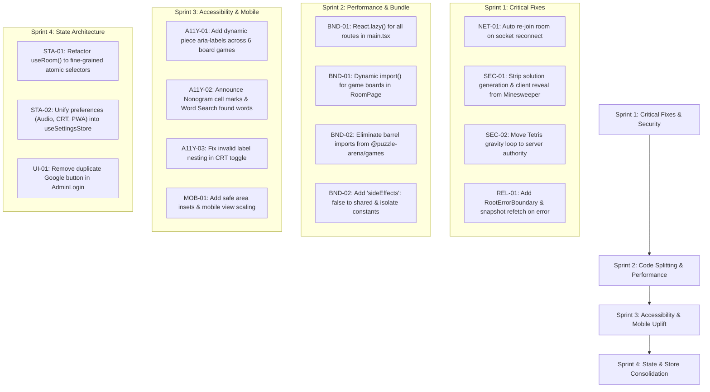

# Puzzle Arena Frontend (Web) Audit Report

**Date:** September 12, 2026  
**Auditor:** Antigravity AI  
**Target:** `apps/web/src/**` (Vite 8.2 + React 19.2 + Tailwind CSS 4.3 + Zustand 5.0 + Socket.io-client 4.8)  
**Dependencies Audited:** `ui/`, `routes/`, `net/`, `games/`, `styles/`, and workspace package linkages (`@puzzle-arena/shared`, `@puzzle-arena/games`, `@puzzle-arena/puzzles`)

---

## 1. Executive Summary

A comprehensive frontend architectural, performance, correctness, accessibility, and reliability audit was conducted across the entire `apps/web/src` codebase of Puzzle Arena. The frontend is built as a single-page application targeting mobile and desktop web browsers, with a distinct 8-bit arcade aesthetic, real-time multiplayer coordination via WebSockets, and support for over twenty puzzle and board games.

While the design system, retro CRT simulation, and Web Audio synthesizer engine are uniquely creative and engaging, the audit revealed **severe architectural vulnerabilities and technical debt** across state management, network resilience, server trust boundaries, bundle distribution, and accessibility:

1. **Silent Socket Desync on Reconnect (Critical):** Mobile network handovers, screen locks, or transient drops cause Socket.io to reconnect with a new socket ID. However, the frontend never re-subscribes to the active room on reconnection. The client falsely displays a green "connected" state while receiving zero game events or snapshot updates, leaving players permanently desynchronized.
2. **Authoritative Trust Boundary Inversion in Minesweeper & Tetris (Critical):** Minesweeper generates the secret mine layout locally from seed and executes `revealCell()` on the client, sending client-calculated lists of revealed indices or `'detonated'` strings to the server. If the seed is hidden, it cannot flood-fill empty cells. Tetris relies on a client-side timer loop to emit `{ type: 'tick' }` gravity steps, granting the client authority over piece fall timing and lock delay.
3. **Monolithic 1.46 MB Initial JavaScript Chunk (High):** Due to zero route-level code splitting (`React.lazy`), zero game-level code splitting in `RoomPage`, barrel file re-exporting in `packages/games/src/index.ts`, and missing `"sideEffects": false` in `@puzzle-arena/shared`, a guest visiting the landing page to enter a 6-digit room code is forced to download **1.46 MB of JavaScript** (401 kB gzipped), including 20 game boards, 15 game engines, AI solvers, and admin consoles.
4. **Widespread Screen Reader Inaccessibility (High):** Interactive board game surfaces (Chess, Xiangqi, Connect 4, Reversi, Animal Chess, Nonogram) contain dozens of `<button>` elements with either empty `aria-label`s or generic coordinates (e.g., `"Square d1"` without announcing piece identity, colour, selection, or legal move status), rendering the majority of games completely unplayable for visually impaired users.
5. **Monolithic Zustand Store Re-render Cascade (Medium):** The single `useRoom` store holds 21 disparate state slices. In `RoomPage`, `useRoom()` is consumed without selectors (`const store = useRoom()`), causing the entire page shell, header, sidebar, chat list, and game surface to re-render on every chat message, timer tick, or move log.
6. **Mobile Viewport & Touch Target Violations (Medium):** 15x15 grids (Scrabble) and 20x20 grids (Nonogram) compress interactive cells to 12px–20px on standard phone viewports (360px–390px wide), well below the 44px minimum touch target guideline, compounded by disabled pinch-to-zoom (`touch-none`).

---

## 2. Summary of Findings by Severity

| ID | Finding | Severity | Category | Impact |
|---|---|---|---|---|
| **NET-01** | Silent Room Desynchronization on Socket Reconnect | **Critical** | Network / State | Sockets reconnecting get new IDs but never re-join rooms; clients freeze silently |
| **SEC-01** | Client-Side Rule Execution & Mine Reveal in Minesweeper | **Critical** | Trust Boundary / Cheat | Client generates full mine map from seed, executes `revealCell`, and self-reports detonation |
| **SEC-02** | Client-Driven Gravity & Lock Delay Loop in Tetris | **High** | Trust Boundary / Engine | Client drives gravity ticks over WebSocket; latency or client throttling freezes fall speed |
| **BND-01** | 1.46 MB Monolithic Bundle via Missing Code Splitting | **High** | Performance / Bundle | All 20 game boards, engines, bots, and admin views bundled into initial landing page load |
| **BND-02** | Barrel Import Poisoning via `BOARD_ENGINES` & Source Aliases | **High** | Build / Tree-Shaking | Importing a single rule constant pulls in all 15 game engines, bots, and dictionary files |
| **A11Y-01** | Missing Piece & State Announcements in Board Game Cells | **High** | Accessibility (a11y) | Chess, Xiangqi, Connect 4, Reversi, Animal Chess buttons lack accessible names |
| **A11Y-02** | Unannounced Nonogram States & Word Search Cross-Outs | **Medium** | Accessibility (a11y) | Screen readers cannot discern filled vs crossed cells or found vs remaining words |
| **A11Y-03** | Invalid Label Nesting in CRT Toggle Switch | **Low** | Accessibility / HTML | `<label>` wraps interactive `<button role="switch">`, creating double clicks & a11y tree issues |
| **A11Y-04** | Missing Dialog Description & Unlinked Select Labels | **Low** | Accessibility / Radix | Radix Dialog emits accessibility warnings; Select label rendered as detached `<span>` |
| **STA-01** | Monolithic Store Subscriptions Without Selectors in `RoomPage` | **Medium** | State Management | Unselected `useRoom()` causes entire game surface to re-render on every chat message |
| **STA-02** | Fragmented State Architecture (Zustand, Modules, Local State) | **Medium** | Architecture | Settings split across Zustand, module closures (`sound.tsx`), and localStorage |
| **STA-03** | Navigation Store State Leak & Reset Race Condition | **Low** | State Management | Stale room state from prior route renders transiently during navigation |
| **NET-02** | Disconnected Socket Emit Timeout & Ghost Queueing | **Medium** | Network / Transport | Timed-out emits resolve with errors but remain queued in Socket.io buffer to fire on reconnect |
| **NET-03** | Broken `api()` Fetch Abort Controller Chaining | **Low** | Network / REST | Passing custom `signal` bypasses internal 12s timeout controller abort |
| **NET-04** | Guest Cookie Minting Race Condition on Socket Handshake | **Medium** | Network / Auth | `getSocket()` auto-connects before `ensureGuest()` finishes writing `pa_guest` cookie |
| **MOB-01** | Micro-Touch Targets on Mobile Grids (Scrabble, Nonogram) | **Medium** | Mobile UX | 12px–20px touch targets on 375px screens with disabled browser zoom |
| **MOB-02** | Missing Safe Area Inset Handling on Fixed Overlays & Modals | **Low** | Mobile UX | Fixed headers, modals, and toolbars overlap with device notches and home bars |
| **GME-01** | Complete Congkak Ruleset Duplication in Frontend View | **Medium** | Rule Duplication | 140 lines of sowing/tembak logic duplicated in React view; risks visual divergence |
| **GME-02** | Ephemeral Local Highlight State in Word Search | **Low** | State / Persistence | Found word paths stored only in component state; lost on refresh or reconnect |
| **UI-01** | Duplicate Google Sign-In Buttons on Admin Login Screen | **Low** | UI Defect | Redundant duplicate Google OAuth button renders above and below form |
| **UI-02** | Incompatible SVG `d: path(...)` CSS Animation in Theme | **Low** | CSS / Cross-Browser | Pac-Man ghost skirt uses CSS path animation unsupported in Safari and WebKit |
| **REL-01** | Inadequate Error Boundary Reset & Lack of Root Boundary | **Medium** | Reliability | `GameErrorBoundary` does not resync state; uncaught top-level error causes white screen |

---

## 3. Detailed Audit Findings

---

### Focus Area 1: Real-Time Networking, Reconnection & Authoritative Desync

#### NET-01: Silent Room Desynchronization on Socket Reconnect (Critical)
* **File:** [apps/web/src/net/socket.ts](file:///C:/Users/AS/projects/puzzle2/apps/web/src/net/socket.ts#L139-L143), [apps/web/src/routes/RoomPage.tsx](file:///C:/Users/AS/projects/puzzle2/apps/web/src/routes/RoomPage.tsx#L158-L161)
* **Description:** In `net/socket.ts`, the connection lifecycle is wired as:
  ```ts
  function wire(s: Socket): void {
    s.on('connect', () => useRoom.setState({ connected: true }));
    s.on('disconnect', () => useRoom.setState({ connected: false }));
    s.on('connect_error', (err) => useRoom.setState({ error: err.message }));
    ...
  }
  ```
  In `RoomPage.tsx`, auto-join only executes once on initial component mount via `useEffect(..., [])`:
  ```tsx
  React.useEffect(() => {
    if (!joined && name.trim().length >= 1) void join(name.trim(), avatar);
  }, []);
  ```
  When a mobile user experiences a network flap, switches from cellular to Wi-Fi, or locks their screen, Socket.io disconnects and subsequently establishes a new WebSocket connection with a **new socket ID**. The server cleans up the old socket and evicts it from the Socket.io room channel (`io.in(roomId)`). 
  
  Neither `socket.ts` nor `RoomPage.tsx` listens for the `connect` event to re-emit `room:join`.
* **Impact:** Once reconnected, `useRoom.connected` flips to `true` and the "Reconnecting..." banner disappears. The user assumes they are connected, but their new socket is **not subscribed to the room on the server**. The client will never receive another `gameState`, `roomSnapshot`, `roomEnded`, or `leaderboard` broadcast. The client is silently frozen until the player hard-refreshes the page.
* **Remediation:** Implement a centralized reconnection handler in `socket.ts` or `RoomPage.tsx`. Cache the current room code and rejoin credentials in `useRoom`; on every `s.on('connect')`, if a room was previously active, automatically re-emit `EV.roomJoin` and reapply the returned snapshot.

```ts
// net/socket.ts
s.on('connect', async () => {
  useRoom.setState({ connected: true });
  const currentRoom = useRoom.getState().room;
  const you = useRoom.getState().you;
  if (currentRoom && you) {
    const res = await emit<RoomSnapshotAck>(EV.roomJoin, {
      code: currentRoom.code,
      displayName: localStorage.getItem('pa:name'),
      avatar: localStorage.getItem('pa:avatar'),
    });
    if (res.snapshot) useRoom.getState().applySnapshot(res.snapshot);
  }
});
```

---

#### NET-02: Disconnected Socket Emit Timeout & Ghost Queueing (Medium)
* **File:** [apps/web/src/net/socket.ts](file:///C:/Users/AS/projects/puzzle2/apps/web/src/net/socket.ts#L214-L229)
* **Description:** The `emit()` wrapper relies on `Promise.withResolvers()` and a `setTimeout`:
  ```ts
  export function emit<T = unknown>(event: string, payload?: unknown, timeoutMs?: number): Promise<T> {
    const { promise, resolve } = Promise.withResolvers<T>();
    const s = getSocket();
    const maxWait = timeoutMs ?? (event === EV.roomStart ? 45_000 : 10_000);
    const timer = setTimeout(() => {
      resolve({ error: 'Request timed out — please check connection' } as unknown as T);
    }, maxWait);

    s.emit(event, payload ?? {}, (response: unknown) => {
      clearTimeout(timer);
      resolve(response as T);
    });
    return promise;
  }
  ```
  By default, Socket.io buffers packets emitted while `socket.connected === false`. If the client loses connection and makes a move, the 10-second timer fires, rejecting the promise locally with `"Request timed out"`. When the connection eventually recovers 15 seconds later, Socket.io flushes its internal send buffer and transmits the stale move anyway.
* **Impact:** The UI shows a timeout error and the user may take another action. When the socket reconnects, the stale queued action is executed on the server unexpectedly, creating out-of-order moves or invalid state rejections.
* **Remediation:** Check `s.connected` before emitting. If disconnected, reject immediately without queueing, or pass `{ timeout: maxWait }` directly to Socket.io's native ack timeout feature:
  ```ts
  s.timeout(maxWait).emit(event, payload, (err: Error | null, response: unknown) => { ... });
  ```

---

#### NET-04: Guest Cookie Minting Race Condition on Socket Handshake (Medium)
* **File:** [apps/web/src/net/socket.ts](file:///C:/Users/AS/projects/puzzle2/apps/web/src/net/socket.ts#L17-L39)
* **Description:** `getSocket()` initializes the socket with `autoConnect: true`:
  ```ts
  let socket: Socket | null = null;
  export function getSocket(): Socket {
    if (!socket) {
      socket = io({ path: '/socket.io', transports: ['websocket', 'polling'], autoConnect: true });
      wire(socket);
    }
    return socket;
  }
  ```
  `ensureGuest()` is an asynchronous function that POSTs to `/api/guest` to mint the `pa_guest` signed cookie required by the server's handshake middleware. If `getSocket()` is called in `RoomPage` before `ensureGuest()` finishes resolving, or if a component imports and invokes `getSocket()` during initialization, the WebSocket handshake initiates without the cookie, resulting in an unauthorized connection or a guest session collision.
* **Remediation:** Set `autoConnect: false` in `io()`. Provide an explicit `connectSocket()` function that awaits `ensureGuest()` before invoking `socket.connect()`.

---

#### NET-03: Broken `api()` Fetch Abort Controller Chaining (Low)
* **File:** [apps/web/src/net/socket.ts](file:///C:/Users/AS/projects/puzzle2/apps/web/src/net/socket.ts#L243-L248)
* **Description:** In `api()`:
  ```ts
  const controller = new AbortController();
  const timer = setTimeout(() => controller.abort(), timeoutMs);
  const signal = init.signal ?? controller.signal;
  const res = await fetch(path, { ...init, headers, credentials: 'same-origin', signal });
  ```
  When the caller supplies their own `init.signal` (e.g. component unmount abort), `signal` evaluates to `init.signal`. However, `timer` aborts `controller`, which is no longer passed to `fetch`.
* **Impact:** Any API call providing a custom signal completely loses the 12-second timeout protection.
* **Remediation:** Combine signals using `AbortSignal.any([controller.signal, init.signal])` (supported in all modern browsers).

---

### Focus Area 2: Authoritative Trust Boundary & Client-Side Rule Duplication

#### SEC-01: Client-Side Rule Execution & Mine Reveal in Minesweeper (Critical)
* **File:** [apps/web/src/games/MinesweeperBoard.tsx](file:///C:/Users/AS/projects/puzzle2/apps/web/src/games/MinesweeperBoard.tsx#L53-L63), [apps/web/src/games/MinesweeperBoard.tsx](file:///C:/Users/AS/projects/puzzle2/apps/web/src/games/MinesweeperBoard.tsx#L131-L153)
* **Description:** `MinesweeperBoard.tsx` attempts to compute the entire puzzle solution directly in the browser:
  ```ts
  const solution = React.useMemo(() => {
    if (propsSolution) return propsSolution;
    if (puzzle.seed !== undefined) {
      return minesweeper.generate({
        seed: puzzle.seed,
        difficulty: puzzle.difficulty ?? (puzzle.rows === 9 ? 'easy' : puzzle.rows === 16 ? 'medium' : 'hard'),
      }).solution;
    }
    return null;
  }, [propsSolution, puzzle]);
  ```
  When the user clicks a cell:
  ```ts
  if (solution) {
    const res = revealCell(solution, revealed, row, col);
    setLocalRevealed(res.revealed);
    if (res.detonated) {
      setLocalDetonated(true);
      sfx.bomb();
      onCommit(`${row},${col}`, 'detonated');
    } else {
      ...
      onCommit(`${row},${col}`, newIndices.join(';'));
    }
  } else {
    sfx.pop();
    onCommit(`${row},${col}`, 1);
  }
  ```
* **Impact:**
  1. **Anti-Cheat Bypass:** If the server passes `puzzle.seed`, any player can inspect React component state or evaluate `minesweeper.generate(seed)` in DevTools to reveal all mine coordinates.
  2. **Authoritative Inversion:** The client tells the server what cells were revealed and whether the player detonated. A malicious client can simply filter out mine cells, report revealed indexes, and never send `'detonated'`.
  3. **Broken Fallback:** If the server adheres to anti-cheat principles and withholds `solution` and `seed`, `solution` is `null`. The client then executes the fallback branch: `onCommit(`${row},${col}`, 1)`. In this mode, the client cannot flood-fill connected zero-clue cells. The player is forced to manually click every single cell, making larger boards unplayable.
* **Remediation:** Remove `minesweeper.generate()` and `revealCell()` from the frontend entirely. The client should simply emit `EV.puzzleCommit` with the clicked coordinate `row,col`. The authoritative server engine must execute `revealCell`, calculate the flood-fill or explosion, and broadcast the resulting revealed cell states back to the room.

---

#### SEC-02: Client-Driven Gravity & Lock Delay Loop in Tetris (High)
* **File:** [apps/web/src/games/TetrisBoard.tsx](file:///C:/Users/AS/projects/puzzle2/apps/web/src/games/TetrisBoard.tsx#L377-L395)
* **Description:** In `TetrisBoard.tsx`, gravity drops and lock delays are driven by the player's browser:
  ```ts
  const grounded = React.useMemo(() => {
    if (!you?.active) return false;
    return tetrisRules.isGrounded(you.board, you.active);
  }, [you?.board, you?.active]);

  React.useEffect(() => {
    if (!you || you.gameOver || view.phase === 'game_over' || paused || !you.active) return;
    const interval = grounded ? 100 : tetrisRules.gravityMs(you.level);
    const loop = () => {
      onAction({ type: 'tick' });
    };
    tickRef.current = window.setTimeout(loop, interval);
    return () => window.clearTimeout(tickRef.current!);
  }, [you?.level, you?.gameOver, you?.active, grounded, view.phase, paused, onAction]);
  ```
* **Impact:** The game loop violates server authority. If a player throttles their browser tab, pauses execution in debugger tools, or modifies the script, their active tetromino hovers in mid-air indefinitely while other players' clocks expire. Conversely, a modified client can flood `{ type: 'tick' }` events to instantly clear garbage or stress the server event loop.
* **Remediation:** The authoritative game server (or a room tick runner) must drive piece gravity. The server should maintain the tick clock, apply gravity drops on schedule, and emit authoritative board snapshots. The client should only send player inputs (`left`, `right`, `rotate`, `hardDrop`, `softDrop`).

---

#### GME-01: Complete Congkak Ruleset Duplication in Frontend View (Medium)
* **File:** [apps/web/src/games/CongkakBoard.tsx](file:///C:/Users/AS/projects/puzzle2/apps/web/src/games/CongkakBoard.tsx#L67-L203)
* **Description:** `CongkakBoard.tsx` contains a 140-line function `generateSowSteps()` that re-implements the complete Congkak game mechanics: circular pit traversal, opponent storehouse skipping, relay sowing pick-ups, opposite pit *tembak* captures, and *mati* ending conditions.
* **Impact:** While intended for animating marble steps, duplicating complex game rules client-side introduces high risk of visual desync. If the server rules are modified (e.g. alternate capture rules or handicap handling), the client's step generator will animate beads along one path while the server's snapshot snaps the board to a different state at the end of the move.
* **Remediation:** The server engine should return the sequence of sowing steps in the move action response or snapshot (e.g. `steps: [{ pit, count }]`), allowing the frontend to purely render the server's authoritative animation path without simulating game logic.

---

#### GME-02: Ephemeral Local Highlight State in Word Search (Low)
* **File:** [apps/web/src/games/WordSearchBoard.tsx](file:///C:/Users/AS/projects/puzzle2/apps/web/src/games/WordSearchBoard.tsx#L53-L94)
* **Description:** When a player successfully finds a word, the tinted coordinates on the grid are stored exclusively in local component state:
  ```tsx
  const [highlights, setHighlights] = React.useState<Record<number, string>>({});
  ```
* **Impact:** The server tracks which words have been found (`found: string[]`), but the exact cell coordinates of previously found words are not derived from the word list or grid. When a player reloads the page, reconnects, or opens the board on another device, all previous word highlights on the grid vanish, displaying a blank grid even though the sidebar shows words crossed off.
* **Remediation:** Compute the cell coordinates of found words deterministically from the public `grid` and `found` list, or have the server return the coordinate paths in `state.foundWords`.

---

### Focus Area 3: Bundle Size, Code Splitting & Tree-Shaking Hazards

#### BND-01: 1.46 MB Monolithic Bundle via Missing Code Splitting (High)
* **File:** [apps/web/src/main.tsx](file:///C:/Users/AS/projects/puzzle2/apps/web/src/main.tsx#L8-L15), [apps/web/src/routes/RoomPage.tsx](file:///C:/Users/AS/projects/puzzle2/apps/web/src/routes/RoomPage.tsx#L35-L54)
* **Description:** Production build analysis of `apps/web` yields:
  ```text
  dist/assets/index-z80I2zJs.js   1,457.10 kB │ gzip: 401.30 kB
  (!) Some chunks are larger than 500 kB after minification.
  ```
  This occurs because:
  1. `main.tsx` imports all routes statically (`Landing`, `AdminLogin`, `AdminSignup`, `AdminDashboard`, `RoomPage`, `ResultsPage`, `UiGallery`, `PacmanHarness`).
  2. `RoomPage.tsx` imports all 20 game boards statically at the top of the file.
  3. Dev-only proof routes (`/ui` and `/dev/pacman`) are statically imported at the top of `main.tsx`. Even though `<Route>` elements check `import.meta.env.DEV`, ES modules are evaluated statically, pulling `UiGallery`, `PacmanHarness`, and their dependencies into the production bundle.
* **Impact:** First Contentful Paint (FCP) and Time to Interactive (TTI) on mobile devices are severely degraded. A user on 4G cellular attempting to play a lightweight puzzle (e.g. Sudoku) must first download the assets, canvases, and engines for Bomberman, Tetris, Pac-Man, and the complete Admin Dashboard.
* **Remediation:**
  1. Convert all top-level routes in `main.tsx` to `React.lazy()` with `<Suspense>` fallbacks.
  2. Dynamically import game boards inside `RoomPage.tsx` based on `gameId`:
     ```tsx
     const BoardComponent = React.lazy(() => import(`../games/${BOARD_MAP[gameId]}.js`));
     ```
  3. Gate dev route imports conditionally or move dev harnesses to a separate entry point.

---

#### BND-02: Barrel Import Poisoning via `BOARD_ENGINES` & Source Aliasing (High)
* **File:** [packages/games/src/index.ts](file:///C:/Users/AS/projects/puzzle2/packages/games/src/index.ts#L219-L235), [packages/shared/package.json](file:///C:/Users/AS/projects/puzzle2/packages/shared/package.json#L1-L21), [apps/web/vite.config.ts](file:///C:/Users/AS/projects/puzzle2/apps/web/vite.config.ts#L17-L19)
* **Description:** In `packages/games/src/index.ts`, the barrel file defines:
  ```ts
  export const BOARD_ENGINES: Partial<Record<GameId, GameEngine<never, never>>> = {
    'property-tycoon': propertyTycoon,
    'manor-mystery': manorMystery,
    ...
  };
  ```
  `vite.config.ts` aliases `@puzzle-arena/games` directly to `../../packages/games/src/index.ts`. Furthermore, `packages/shared/package.json` **omits** `"sideEffects": false`.
  
  When any game view (such as `PropertyTycoonBoard`, `ManorMysteryBoard`, `TetrisBoard`, or `SpaceInvadersBoard`) imports even a single rule constant or helper from `@puzzle-arena/games`, Rollup/Vite processes `index.ts`. Because `BOARD_ENGINES` is an exported object literal with references to all 15 game engine singletons, tree-shaking fails.
* **Impact:** The client bundle pulls in the entire rule sets, move generators, AI bots, deduction engines, and Scrabble dictionary references of every single game in the monorepo.
* **Remediation:**
  1. Add `"sideEffects": false` to `packages/shared/package.json` and ensure it is honoured across workspaces.
  2. Move pure constants, tile grids, and type definitions into `@puzzle-arena/shared`.
  3. Change web views to import exclusively types from `@puzzle-arena/games`, or configure subpath exports (e.g. `@puzzle-arena/games/property-tycoon/constants`).

---

### Focus Area 4: Accessibility (a11y) & Assistive Technology Deficits

#### A11Y-01: Missing Piece & State Announcements in Board Game Cells (High)
* **File:** [apps/web/src/games/ChessBoard.tsx](file:///C:/Users/AS/projects/puzzle2/apps/web/src/games/ChessBoard.tsx#L349), [apps/web/src/games/XiangqiBoard.tsx](file:///C:/Users/AS/projects/puzzle2/apps/web/src/games/XiangqiBoard.tsx#L289), [apps/web/src/games/Connect4Board.tsx](file:///C:/Users/AS/projects/puzzle2/apps/web/src/games/Connect4Board.tsx#L177), [apps/web/src/games/Connect4Board.tsx](file:///C:/Users/AS/projects/puzzle2/apps/web/src/games/Connect4Board.tsx#L218), [apps/web/src/games/ReversiBoard.tsx](file:///C:/Users/AS/projects/puzzle2/apps/web/src/games/ReversiBoard.tsx#L196), [apps/web/src/games/AnimalChessBoard.tsx](file:///C:/Users/AS/projects/puzzle2/apps/web/src/games/AnimalChessBoard.tsx#L229)
* **Description:** A systematic review of interactive game boards revealed critical screen reader omissions:
  - **Chess:** `<button aria-label={`Square ${squareName(square)}`}>`. When a piece occupies the square, the screen reader announces `"Square e4"`. It does not announce `"White Pawn"`, `"Selected"`, `"In Check"`, or `"Legal destination"`.
  - **Xiangqi:** `<button aria-label={`Point ${row},${col}`}`. Completely omits Chinese chess piece names (e.g. `"Red General"`, `"Black Cannon"`).
  - **Connect 4:** The 7 drop buttons and all 42 grid cell buttons have **no `aria-label` at all**.
  - **Reversi:** All 64 grid buttons have **no `aria-label`**, role, or state.
  - **Animal Chess:** All 63 terrain squares have **no `aria-label`**.
* **Impact:** Visually impaired users using VoiceOver, NVDA, or TalkBack cannot determine the state of the game board or make intentional moves.
* **Remediation:** Provide rich, dynamic `aria-label`s on all board cell buttons:
  ```tsx
  aria-label={`${squareName(square)}: ${piece ? `${piece.side === 0 ? 'White' : 'Black'} ${PIECE_NAMES[piece.type]}` : 'Empty'}${isSelected ? ', selected' : ''}${isDest ? ', legal move target' : ''}`}
  ```

---

#### A11Y-02: Unannounced Nonogram States & Word Search Cross-Outs (Medium)
* **File:** [apps/web/src/games/NonogramBoard.tsx](file:///C:/Users/AS/projects/puzzle2/apps/web/src/games/NonogramBoard.tsx#L189), [apps/web/src/games/WordSearchBoard.tsx](file:///C:/Users/AS/projects/puzzle2/apps/web/src/games/WordSearchBoard.tsx#L181-L196)
* **Description:**
  - In `NonogramBoard.tsx`: Each cell button has `aria-label={`Row ${r + 1} column ${c + 1}`}`. It never reflects whether the cell is `FILLED`, `CROSSED`, or `EMPTY`.
  - In `WordSearchBoard.tsx`: Found words are visually crossed out using CSS `line-through text-pa-ink-dim`. Screen readers announce the word names identically whether found or unfound.
* **Remediation:**
  - In Nonogram: `aria-label={`Row ${r + 1} Col ${c + 1}: ${mark === FILLED ? 'Filled' : mark === CROSSED ? 'Crossed' : 'Empty'}`}`.
  - In Word Search: Add visually hidden status text: `<span className="sr-only">{done ? 'Found' : 'Remaining'}: </span>{word}`.

---

#### A11Y-03: Invalid Label Nesting in CRT Toggle Switch (Low)
* **File:** [apps/web/src/ui/crt.tsx](file:///C:/Users/AS/projects/puzzle2/apps/web/src/ui/crt.tsx#L41-L60)
* **Description:** `CrtToggle` renders:
  ```tsx
  <label className="flex items-center justify-between gap-3 cursor-pointer">
    <span className="font-display text-[10px] uppercase">CRT Scanlines</span>
    <button type="button" role="switch" aria-checked={on} onClick={toggle}>
      ...
    </button>
  </label>
  ```
  Under the HTML specification, `<label>` elements must not contain interactive button elements.
* **Impact:** Tapping the label area in certain browsers dispatches dual synthetic click events, and accessibility auditing tools (Lighthouse, axe-core) flag this as a critical form/label violation.
* **Remediation:** Change the outer `<label>` to a `<div>` and associate it via `id` and `aria-labelledby`.

---

#### A11Y-04: Missing Dialog Description & Unlinked Select Labels (Low)
* **File:** [apps/web/src/ui/primitives.tsx](file:///C:/Users/AS/projects/puzzle2/apps/web/src/ui/primitives.tsx#L177-L183), [apps/web/src/ui/primitives.tsx](file:///C:/Users/AS/projects/puzzle2/apps/web/src/ui/primitives.tsx#L257-L287)
* **Description:**
  - `PixelDialog` renders `<Dialog.Title>`, but omits `<Dialog.Description>` without setting `aria-describedby={undefined}`. Radix UI logs an accessibility warning in the browser console.
  - `PixelSelect` renders its `label` prop as an unlinked `<span>`. It is not programmatically associated with the Radix `Select.Trigger`.
* **Remediation:** Add `<Dialog.Description className="sr-only">` or `aria-describedby={undefined}` to `PixelDialog`. Link `PixelSelect` label using `aria-label` or `aria-labelledby`.

---

### Focus Area 5: State Management & Zustand Store Design

#### STA-01: Monolithic Store Subscriptions Without Selectors in `RoomPage` (Medium)
* **File:** [apps/web/src/routes/RoomPage.tsx](file:///C:/Users/AS/projects/puzzle2/apps/web/src/routes/RoomPage.tsx#L108), [apps/web/src/routes/RoomPage.tsx](file:///C:/Users/AS/projects/puzzle2/apps/web/src/routes/RoomPage.tsx#L820), [apps/web/src/routes/ResultsPage.tsx](file:///C:/Users/AS/projects/puzzle2/apps/web/src/routes/ResultsPage.tsx#L49)
* **Description:** In `RoomPage.tsx` and `ResultsPage.tsx`, the store is consumed directly:
  ```tsx
  const store = useRoom();
  ```
  In Zustand 5, calling `useStore()` without a selector causes the component to re-render whenever **any** property in the store changes.
  
  `useRoom` holds: `room`, `players`, `you`, `state`, `legalActions`, `endsAt`, `turnEndsAt`, `startsAt`, `leaderboard`, `log`, `chat`, `results`, `error`, `paused`, `clocks`, `clockActor`, `clockRunningSince`, `moveDeadline`.
* **Impact:** Every single chat message sent by any player, every log entry added to the move history, every second of clock update, and every leaderboard score shift re-renders the root `RoomPage`, its modals, and the nested `GameSurface`. In fast-paced games (Bomberman, Pac-Man) or during active chat conversations, this introduces frame drops and input lag.
* **Remediation:** Refactor to atomic selectors:
  ```tsx
  const room = useRoom((s) => s.room);
  const you = useRoom((s) => s.you);
  const gameState = useRoom((s) => s.state);
  ```
  Isolate `chat` into a dedicated `useChatStore` or subscribe only within the chat drawer component.

---

#### STA-02: Fragmented State Architecture (Medium)
* **File:** [apps/web/src/ui/sound.tsx](file:///C:/Users/AS/projects/puzzle2/apps/web/src/ui/sound.tsx#L15-L26), [apps/web/src/ui/crt.tsx](file:///C:/Users/AS/projects/puzzle2/apps/web/src/ui/crt.tsx#L12-L29), [apps/web/src/ui/install-prompt.tsx](file:///C:/Users/AS/projects/puzzle2/apps/web/src/ui/install-prompt.tsx#L42-L45)
* **Description:** App-level preferences are scattered across disparate storage mechanisms:
  - CRT toggle lives in a dedicated Zustand store (`useCrt`).
  - Room and gameplay state live in `useRoom`.
  - Audio volumes and toggles live in module-level variables (`let sfxEnabled`, `let musicEnabled`) in `sound.tsx` synchronized via an ad-hoc React hook (`useAudioSettings`).
  - PWA install dismissal lives in local React state in `InstallPrompt`.
* **Impact:** No unified preferences store; audio state changes made outside React hooks do not trigger UI updates consistently; difficult to unit test or mock during automated verification.
* **Remediation:** Consolidate client settings (sound effects, music, CRT scanlines, install prompt status, player name/avatar) into a unified, persisted Zustand store (`useSettingsStore`) using Zustand's `persist` middleware.

---

#### STA-03: Navigation Store State Leak & Reset Race Condition (Low)
* **File:** [apps/web/src/routes/RoomPage.tsx](file:///C:/Users/AS/projects/puzzle2/apps/web/src/routes/RoomPage.tsx#L165), [apps/web/src/routes/RoomPage.tsx](file:///C:/Users/AS/projects/puzzle2/apps/web/src/routes/RoomPage.tsx#L173-L175)
* **Description:** In `RoomPage.tsx`:
  ```tsx
  const room = store.room?.code === codeUpper ? store.room : null;
  React.useEffect(() => {
    if (useRoom.getState().room?.code !== codeUpper) useRoom.getState().reset();
  }, [codeUpper]);
  ```
  When navigating directly from `/r/CODE1` to `/r/CODE2`, the component mounts and renders its first frame before the `useEffect` cleanup/reset executes. During this initial render, `store.players`, `store.state`, `store.chat`, and `store.leaderboard` still contain `CODE1`'s data.
* **Impact:** Transient visual glitch showing previous room's players or scores before snapping to blank.
* **Remediation:** Execute `useRoom.getState().reset()` in the router navigation handler or cleanup function of the prior room page.

---

### Focus Area 6: Responsive & Mobile Layout (Phone Playability)

#### MOB-01: Micro-Touch Targets on Mobile Grids (Scrabble, Nonogram) (Medium)
* **File:** [apps/web/src/games/ScrabbleBoard.tsx](file:///C:/Users/AS/projects/puzzle2/apps/web/src/games/ScrabbleBoard.tsx#L150), [apps/web/src/games/NonogramBoard.tsx](file:///C:/Users/AS/projects/puzzle2/apps/web/src/games/NonogramBoard.tsx#L83-L84)
* **Description:** On standard mobile screens (375px wide, e.g. iPhone SE, iPhone 13 mini):
  - **Scrabble (15x15):** The board width is constrained to `min(94vw, 640px) = ~352px`. Divided by 15 cells, each square is **23.4px wide**.
  - **Nonogram (20x20):** After subtracting the clue gutter, cells scale down via `clamp(12px, calc(...), 30px)` to **12px–14px**.
  Both boards disable browser zoom via `touch-none` and `user-select: none`.
* **Impact:** Violates WCAG 2.5.5 / 2.5.8 target size criteria. Players frequently mis-tap adjacent squares, leading to accidental tile placements or wasted moves in competitive matches.
* **Remediation:** Implement a mobile pan-and-zoom viewport wrapper for dense grids (15x15 and 20x20), or provide a cell magnifying loupe / cursor-based directional pad navigation on mobile devices.

---

#### MOB-02: Missing Safe Area Inset Handling on Fixed Overlays & Modals (Low)
* **File:** [apps/web/src/ui/primitives.tsx](file:///C:/Users/AS/projects/puzzle2/apps/web/src/ui/primitives.tsx#L261-L265), [apps/web/src/routes/RoomPage.tsx](file:///C:/Users/AS/projects/puzzle2/apps/web/src/routes/RoomPage.tsx#L336-L342)
* **Description:** While `InstallPrompt.tsx` explicitly includes `marginBottom: env(safe-area-inset-bottom)`, `PixelDialog`, the sticky reconnection banner in `RoomPage`, and bottom game action bars omit `env(safe-area-inset-*)`.
* **Impact:** On iOS devices with home indicator bars or Dynamic Island notches, bottom action buttons (e.g. "Pass", "Submit", "Cancel") collide with the iOS gesture bar.
* **Remediation:** Apply `pb-[max(1rem,env(safe-area-inset-bottom))]` and `pt-[max(0.5rem,env(safe-area-inset-top))]` to fixed root shells and bottom action rows.

---

### Focus Area 7: Loading, Error States & Resilience

#### REL-01: Inadequate Error Boundary Reset & Lack of Root Boundary (Medium)
* **File:** [apps/web/src/routes/RoomPage.tsx](file:///C:/Users/AS/projects/puzzle2/apps/web/src/routes/RoomPage.tsx#L62-L101), [apps/web/src/main.tsx](file:///C:/Users/AS/projects/puzzle2/apps/web/src/main.tsx#L32-L53)
* **Description:**
  1. `RoomPage.tsx` defines a local `GameErrorBoundary` around board rendering. When an error is caught, the reset button executes:
     ```tsx
     onClick={() => this.setState({ hasError: false, error: null })}
     ```
     It does not reset the corrupted state in `useRoom` or request a fresh snapshot from the server. If the crash was triggered by malformed state in `store.state`, re-rendering immediately crashes again.
  2. In `main.tsx`, there is **no root-level React ErrorBoundary**.
* **Impact:** Any unhandled rendering error in `Landing`, `AdminDashboard`, `CrtLayer`, or `RoomPage` outside the board crashes the entire React fiber tree, displaying an unrecoverable blank white screen.
* **Remediation:** Wrap `<App />` in a top-level `RootErrorBoundary` that displays an arcade-styled crash screen with a "Restart Arena" button. Update `GameErrorBoundary` to invoke `emit(EV.roomJoin)` on retry to fetch an authoritative, clean snapshot.

---

### Focus Area 8: UI Consistency, CSS Incompatibilities & Merge Artifacts

#### UI-01: Duplicate Google Sign-In Buttons on Admin Login Screen (Low)
* **File:** [apps/web/src/routes/AdminLogin.tsx](file:///C:/Users/AS/projects/puzzle2/apps/web/src/routes/AdminLogin.tsx#L84-L109), [apps/web/src/routes/AdminLogin.tsx](file:///C:/Users/AS/projects/puzzle2/apps/web/src/routes/AdminLogin.tsx#L150-L177)
* **Description:** `AdminLogin.tsx` renders two identical "Continue with Google" buttons:
  - Top button: lines 84–108 (before the email/password form).
  - Bottom button: lines 150–177 (after the email/password form, with another "Or" separator).
* **Impact:** Obvious UI glitch and redundant DOM footprint resulting from an incomplete merge or refactor.
* **Remediation:** Remove the duplicate bottom button (lines 142–177).

---

#### UI-02: Incompatible SVG `d: path(...)` CSS Animation in Theme (Low)
* **File:** [apps/web/src/styles/theme.css](file:///C:/Users/AS/projects/puzzle2/apps/web/src/styles/theme.css#L284-L293)
* **Description:** In `theme.css`:
  ```css
  .pa-ghost-walk .pa-ghost-skirt {
    animation: pa-ghost-wave 460ms ease-in-out infinite alternate;
  }
  @keyframes pa-ghost-wave {
    from { d: path('M1 15 V7 A7 7 0 0 1 15 7 V15 L13.3 13 ... Z'); }
    to   { d: path('M1 15 V7 A7 7 0 0 1 15 7 V15 L13.3 15 ... Z'); }
  }
  ```
  The comment directly above lines 216–225 warns against using `d: path()` interpolation because it is unsupported in multiple SVG renderers. Yet lines 284–293 use `d: path()` keyframe animation for Pac-Man ghost skirts.
* **Impact:** In Safari (iOS and macOS) and certain WebKit builds, the ghost skirt animation fails to interpolate or logs CSS parsing warnings.
* **Remediation:** Animate ghost skirt waving using two alternating SVG frames toggled via CSS or SVG polygon coordinates instead of CSS `d: path()` interpolation.

---

## 4. Prioritized Remediation Roadmap



### Phase 1: Critical Resiliency & Trust Boundary Fixes (Immediate)
1. **Fix Socket Reconnection (NET-01):** Wire `s.on('connect')` to re-emit `room:join` with cached room code and player profile. Ensure snapshots are reapplied so gameplay resumes seamlessly without page reloads.
2. **Restore Minesweeper Trust Boundary (SEC-01):** Remove `minesweeper.generate()` and `revealCell()` from `MinesweeperBoard.tsx`. Ensure server is the sole authority for cell reveals and detonation.
3. **Shift Tetris Gravity to Server (SEC-02):** Eliminate client-driven `{ type: 'tick' }` timeout loop. Server must advance gravity and broadcast updates.

### Phase 2: Bundle Splitting & Tree-Shaking (Target: <200 kB initial chunk)
1. **Route-Level Splitting (BND-01):** Convert `Landing`, `AdminDashboard`, `RoomPage`, `ResultsPage` to `React.lazy()` in `main.tsx`.
2. **Game-Level Splitting (BND-01):** Lazy-load individual board components in `RoomPage.tsx`. A player joining a Connect 4 game should only download the Connect 4 view.
3. **De-poison Barrel Imports (BND-02):** Move shared game constants (`BOARD`, `GROUPS`, `SUSPECTS`, `WEAPONS`) to `@puzzle-arena/shared`. Ensure `@puzzle-arena/games` is never imported at runtime in the web bundle.

### Phase 3: Accessibility (WCAG 2.1 AA Compliance)
1. **Rich Board Announcements (A11Y-01, A11Y-02):** Equip all interactive buttons in Chess, Xiangqi, Connect 4, Reversi, Animal Chess, and Nonogram with comprehensive `aria-label`s indicating coordinate, occupant, and legal move eligibility.
2. **HTML & Semantic Validations (A11Y-03, A11Y-04):** Fix CRT toggle `<label>` nesting; add `aria-describedby` to `PixelDialog`; link `PixelSelect` labels.

### Phase 4: Store Optimization & UI Cleanup
1. **Atomic Selectors (STA-01):** Replace all blanket `const store = useRoom()` calls with fine-grained selectors. Separate chat messages into an isolated store.
2. **UI Cleanup (UI-01, UI-02):** Remove the duplicate Google OAuth button in `AdminLogin.tsx` and replace WebKit-incompatible CSS skirt animation in `theme.css`.
